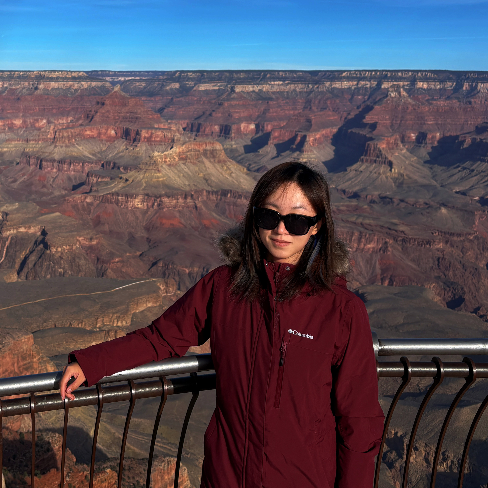
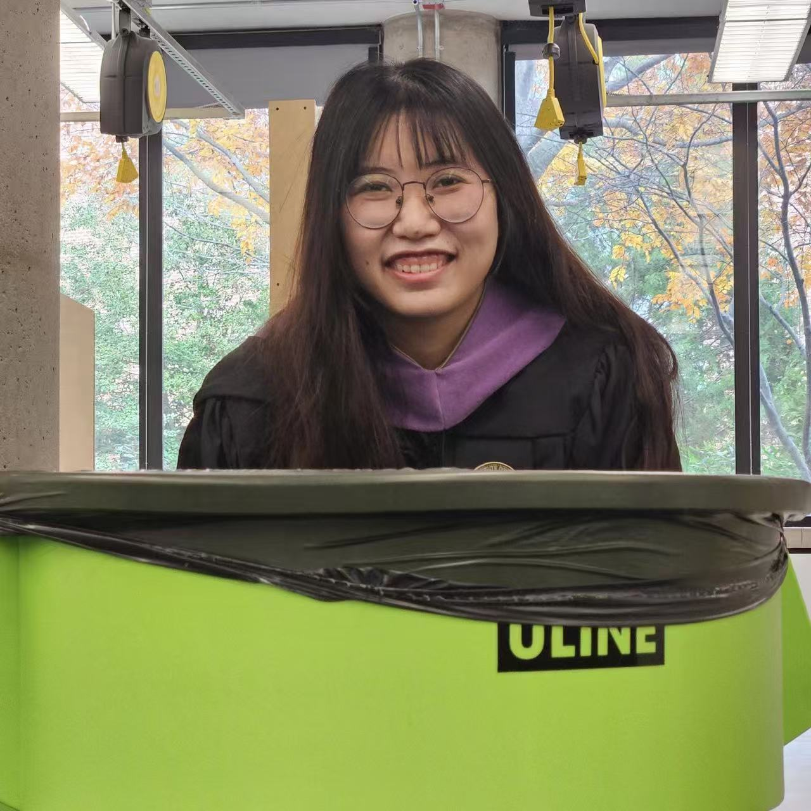

# [Team Cook] — Creative Motion Control Course Site

## Team Members

  
  <h3>Jintong Yang</h3>
  
<em>PhD, Media Arts and Technology</em>

  
Hi! Before joining the program, I completed an MFA in Computer Arts and worked as a motion designer and technical artist in NYC. I am interested in digital fabrication, XR, and interaction design. I am excited to explore digital fabrication workflows, how to control and personalize my own CNC machine end-to-end, and how to combine it with visuals such as motion graphics and real-time interactions.

  
  <h3>Zhifan Guo</h3>
  
<em>PhD, Media Arts and Technology</em>

  
Hi there! I am Zhifan, a first-year PhD student in MAT. With a background in industrial design, I enjoys crafting poetic and delightful connections with the physical world. I am passionate to explore how computational tools could augment our curiosity, creativity, and sustainable practices in interaction with tangible artifacts.

<!-- Copy the block above to add more team members -->

## Projects

| Project | Description |
|---------|-------------|
| [Project 1 - Proposal](projects/project1/docs/proposal-project-1.md) | *An interactive CNC plotter system* |
| [Project 1](projects/project1/docs/index.md) | *An interactive CNC plotter system* |
| [Final Project - Proposal](projects/final-project/docs/proposal-final-project.md) | *An interface for paper embroidery* |
| [Project 2](projects/project2/docs/index.md) | *An interface for paper embroidery* |
<!-- Add rows as you complete more projects:
| [Project 2](projects/project2/docs/) | *Brief description of project 2* |
| [Project 3](projects/project3/docs/) | *Brief description of project 3* |
-->
