# Final Documentation

## Overview

We designed a physical interface for exploring paper embroidery. Paper embroidery is a hybrid craft. It uses paper (cardstock, photos, prints, paintings) as the base and tracing surface, and embroidery as the decorative layer on top.

Our goal is to let the user spend their creativity where it matters, designing the pattern and threading, and let the machine handle the tedious part, punching the holes.

**How it works:**

Using our combined workspace, the user does the following:

1. Place the paper on the defined area.
2. Grab the pen on our DIY pantograph.
3. Press the "record" button on the side of the pen.
4. Draw the outline you want to embroider.
5. Press the "record" button again to stop recording.
6. Use the two sliders to set the scale of the path and the punch interval (the spacing between holes).
7. Use the encoders to move the punch needle to the start of your trace.
8. Press the "playback" button on the base board. The AxiDraw then drives the needle to punch the paper along the path at the preset intervals.

When the punching is done, the user embroiders through the holes following the path.


## Implementation

### Workspace

We laser cut and assembled the workspace base. It has holes for fixing the Stepdance boards (basic module), the pantograph, and a punching area shared by the pantograph and AxiDraw, with several punching areas of different measured sizes. A felt mat covers the punching area, held in place by magnets.

To decide the dimensions of this workspace, we first placed the pantograph, Stepdance boards, and AxiDraw on a table together. We tested the pantograph in different locations and orientations to maximize its drawing area without hindering the movement of AxiDraw. Then, we transferred our measurements to CAD file while adjusting some details. We also added additional holes (M3 screw size) to the CAD file for future component fixation. After assembling all the components on the workspace board, we glued several feet beneath the board to make sure the height is even.

<p align = "left">
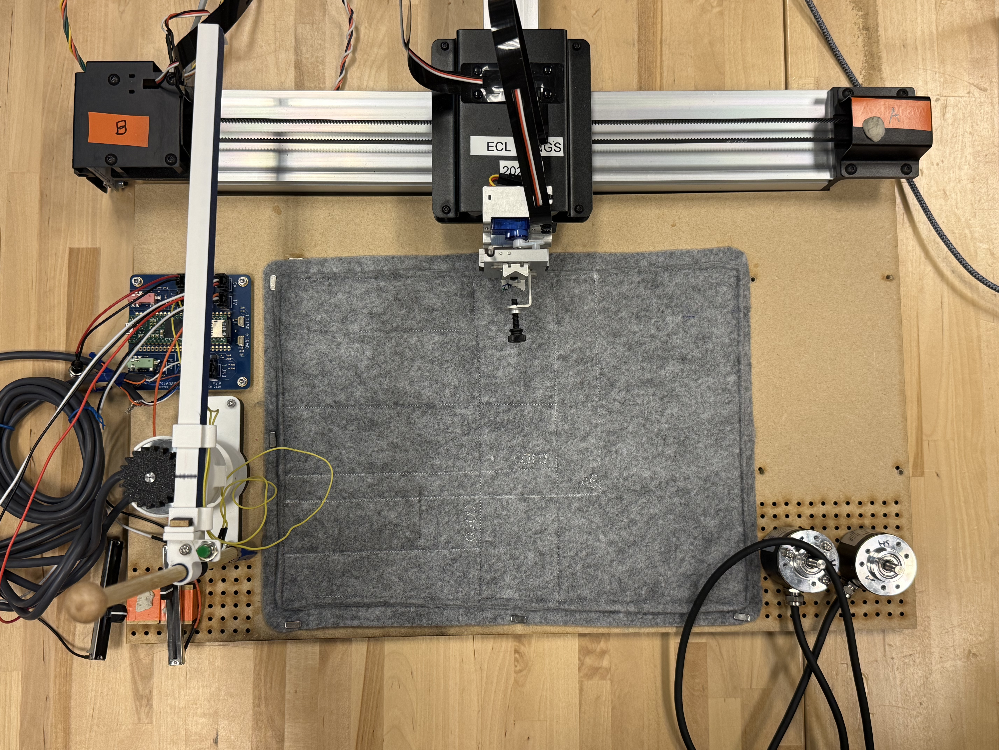
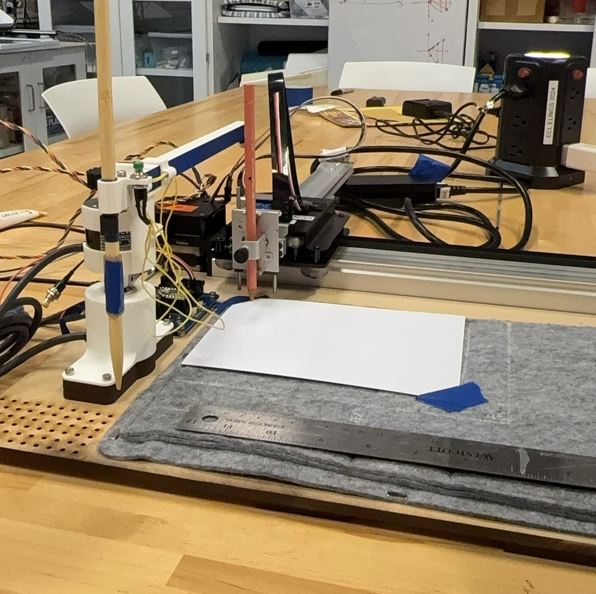
</p>

### Pantograph

Our first iteration embedded a spring in the pen to serve as the “record” switch, but this proved extremely unstable since the pen's lateral wobble severely disrupted smooth drawing. In the second iteration, we reinforced the rail structure guiding the rack and used rapid prototyping to secure the pen to the rack with glue and zip ties. We then extended the rack's length and added a latch between the encoders to establish a home position. A claw‑shaped pen holder was designed and screwed onto the rack for better stability; however, it was too tight to permit pen rotation, which hindered smooth movement.

Further testing revealed that the pantograph did not lock into the home position but rotated slightly due to stiffness in the encoder cables. To remedy this, we added magnets to the latches and attached a cable organizer to the top encoder housing. For the pen holder, we replaced the claw with a ring and two movable fasteners to allow rotation while maintaining stability. Finally, we updated all model dimensions to accommodate the two new encoders we adopted.

After figuring out the placements on the workspace, we found that the structure of the pantograph cannot be ignored in the polar-to-Cartesian transition, and its path was compressed in a certain direction. So we modified the SSL, adding a customized kinematics that accounts for the pen's position relative to the pantograph center during the polar‑to‑Cartesian calculation.

```cpp

void KinematicsPolarToCartesianOffset::run(){
  //update radius and angle positions
  input_angle.pull();
  input_radius.pull();
  input_angle.update();
  input_radius.update();

  float64_t angle_reduced = std::remainder(position_a, TWO_PI); // Reduce current_t to range of 2 PI; I believe this may speed up sin and cos functions...

  output_x.set((position_r + 48 )* std::cos(angle_reduced) - 19 * std::sin(angle_reduced));
  output_y.set((position_r + 48 ) * std::sin(angle_reduced) + 19 * std::cos(angle_reduced));

  output_x.push();
  output_y.push();
}

```

Here are some photos:

<p align = "left">
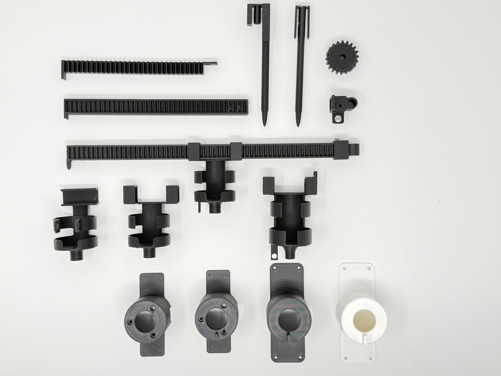
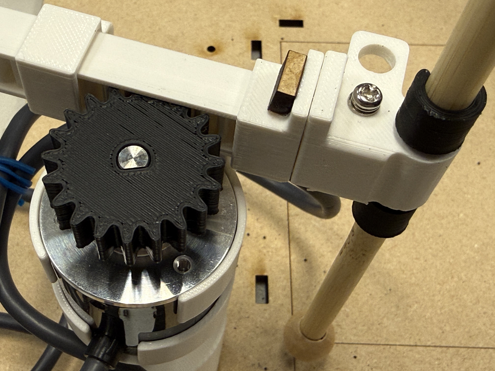
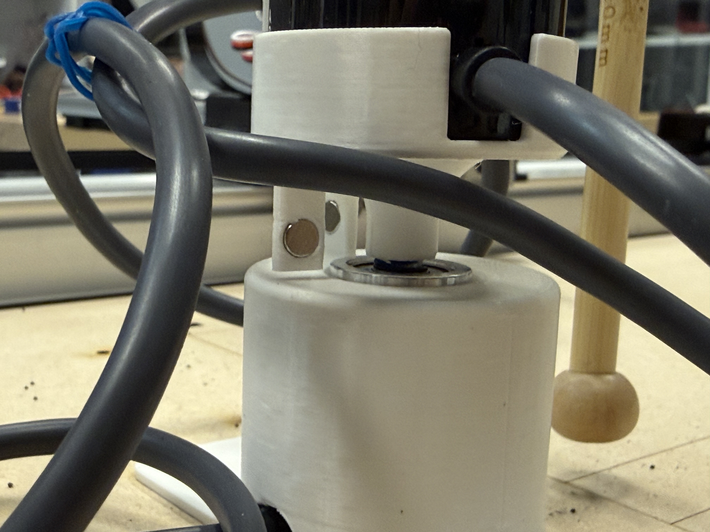
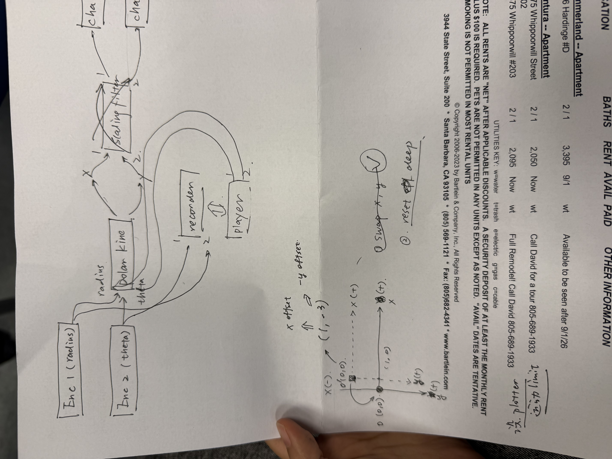
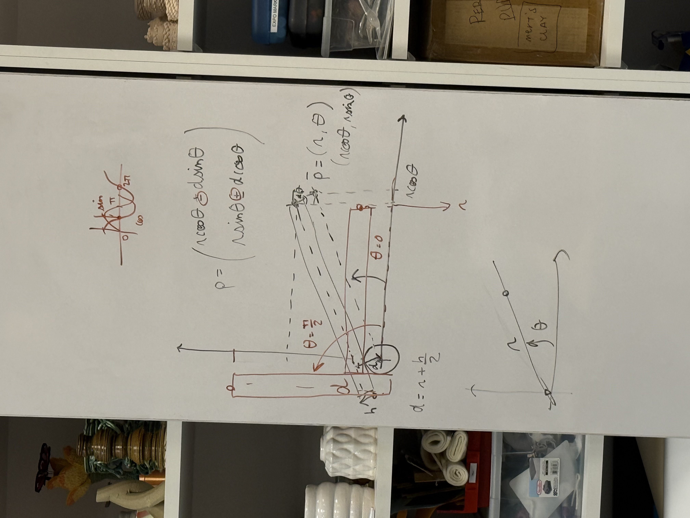
</p>

For punching, we use a base module with an SD card, together with the "recording and playback" and "path length generator" functions in the Stepdance library. The system records the length and shape of the drawn path, then plays it back as a series of evenly spaced punch points along that path at the chosen interval.

We added another two encoders for users to set the starting punch point. Since the AxiDraw uses relative motion, it cannot record where the original drawing started, so the user sets that point manually with the encoders.


### Code

- Basic module

```cpp
/*
This sketch is for the stepdance basic module of the paper_embroidery project
input includes: 
1. pantograph (two encoders)
2. button_1: to identify recording strat/stop
3. button_2: to enable playback + send signal to the driver_module
4. slider_1: control the scaling filter when replay
5. slider_2: control the parsing length (path_length generator)
*/

#define module_basic 
#include "stepdance.hpp"

// -- Define Output Ports --

OutputPort output_a;  // Basic Module output port

// -- Define Motion Channels --
Channel channel_x;
Channel channel_y;
Channel channel_z; 

// -- Define Kinematics --
KinematicsPolarToCartesianOffset polar_kinematics_offset;

// -- Define Encoders --
Encoder encoder_theta;   //bottom, enc_1
Encoder encoder_radius;  //top, enc_2

// -- Button Input --
Button record_button; //D1
Button play_button; //D2

// -- Analog Input --
AnalogInput scaling_slider_a1;
AnalogInput parsing_slider_a2; 

// -- Scaling --
ScalingFilter2D scaling_filter;

// -- Record & Playback --
FourTrackRecorder recorder;
FourTrackPlayer player;

// -- Position Gen --
PositionGenerator position_gen_x;
PositionGenerator position_gen_y;
PositionGenerator position_gen;

// -- TBI---
TimeBasedInterpolator TBI;

// --other---
PathLengthGenerator2D path_length_gen;
float64_t path_length_at_start = 0;

ControlParameter punch_interval;   
float64_t next_punch_at = 0;
bool punch_armed = false;


void setup() {
  // -- Configure and start the output ports --
  output_a.begin(OUTPUT_A);

  // -- Configure and start the channels --
  channel_x.begin(&output_a, SIGNAL_X);
  channel_x.set_ratio(0.01, 1); //basic resolution of 1 output step = 0.01mm
  
  channel_y.begin(&output_a, SIGNAL_Y);
  channel_y.set_ratio(0.01, 1);

  channel_z.begin(&output_a, SIGNAL_Z);
  channel_z.set_ratio(0.01, 1);

  // -- Configure and start the encoders --
  encoder_theta.begin(ENCODER_2);  // BOTTOM ENCODER
  encoder_theta.set_ratio(TWO_PI, 4096); //E6B2-CWZ3E resolution up to 1024ppr
  //encoder_theta.invert();
  encoder_theta.output.map(&polar_kinematics_offset.input_angle);

  encoder_radius.begin(ENCODER_1);  // TOP ENCODER
  encoder_radius.set_ratio(95, 4096); ////E6B2-CWZ3E resolution up to 1024ppr(x4), about 98mm travle length for one round
  encoder_radius.invert();
  encoder_radius.output.map(&polar_kinematics_offset.input_radius);

  polar_kinematics_offset.begin(19); //out the offset d value into it (r + h/2)

  // -- Scaling Filter --
  scaling_filter.begin(); //defaults to incremental mode
  //swap x, y when output
  scaling_filter.output_1.map(&channel_y.input_target_position); 
  scaling_filter.output_2.map(&channel_x.input_target_position);
  scaling_filter.ratio = 1.0;

  scaling_slider_a1.begin(IO_A1);
  scaling_slider_a1.set_floor(0.1);
  scaling_slider_a1.set_ceiling(1);//can only scaling down
  scaling_slider_a1.set_deadband(1, 509, 4); //what are the numbers mean?
  // scaling_slider_a1.map(&scaling_filter.ratio);

  parsing_slider_a2.begin(IO_A2);
  parsing_slider_a2.set_floor(2);             //minimal gap 2mm
  parsing_slider_a2.set_ceiling(25);          //maximum gap 25mm
  parsing_slider_a2.map(&punch_interval);
  // punch_interval = 5.0;

  // -- buttons --
  record_button.begin(IO_D1, INPUT_PULLDOWN);
  record_button.set_mode(BUTTON_MODE_TOGGLE);
  record_button.set_callback_on_press(&start_recording);
  record_button.set_callback_on_release(&stop_recording);

  play_button.begin(IO_D2, INPUT_PULLDOWN);
  play_button.set_mode(BUTTON_MODE_STANDARD);
  play_button.set_callback_on_press(&playback_control);

  recorder.input_1.map(&polar_kinematics_offset.output_x);
  recorder.input_2.map(&polar_kinematics_offset.output_y);
  recorder.begin();

  player.output_1.map(&scaling_filter.input_1);
  player.output_2.map(&scaling_filter.input_2);
  player.begin();

  //disable the output channel, so the plotter won't move with the pantograph, only enable it when playback
  channel_x.disable();
  channel_y.disable();

  // //TBI set up
  TBI.output_z.map(&channel_z.input_target_position);

  TBI.begin();

  //  --path length gen--
  path_length_gen.input_1.map(&scaling_filter.output_1);
  path_length_gen.input_2.map(&scaling_filter.output_2);
  path_length_gen.set_ratio(1.0);  // output.distance = 1.0 * input.distance mm
  path_length_gen.begin();

  dance_start();
}


LoopDelay overhead_delay;


void loop() {
  overhead_delay.periodic_call(&report_overhead, 500);

  if (punch_armed) {
    float64_t current_path_length = path_length_gen.output.read_absolute();
    if (current_path_length >= next_punch_at) {
      player.pause();
      punch_action();
      delay(2000);
      player.resume();
      next_punch_at += punch_interval;   //set the next punch hole
    }
  }

  dance_loop(); 

  if(player.playback_active){
  channel_x.enable();
  channel_y.enable();
  punch_armed = true;

  //disable the encoder to avoid motion conflict by accidental touch
  encoder_radius.output.disable();
  encoder_theta.output.disable();

  }else{
      //disable output channel again
  channel_x.disable();
  channel_y.disable();
  //enable encoder to track position
  encoder_radius.output.enable();
  encoder_theta.output.enable();

  punch_armed = false;
  }
}


void start_recording(){
  recorder.start("recording_name");
  //path_length_at_start = path_length_gen.output.read_absolute();
  Serial.println("STARTED RECORDING");
  Serial.print(" | punch every ");
  Serial.print(punch_interval, 1);
  Serial.println(" mm");
}
 
void stop_recording(){
  recorder.stop();
  Serial.println("STOPPED RECORDING");
}


void playback_control(){
  if(player.playback_active){
    stop_playback();
  }else{
    start_playback();
  }
}


void start_playback(){
  //path_length_at_start = path_length_gen.output.read_absolute();
  next_punch_at = punch_interval;

  path_length_gen.output.reset(0);

  player.start("recording_name");

  Serial.println("STARTED PLAYING");

  int duration_s = player.max_num_playback_samples / (CORE_FRAME_FREQ_HZ);

  Serial.print("DURATION: ");
  Serial.print(static_cast<int>(duration_s / 60));
  Serial.print("m:");
  Serial.print(duration_s % 60);
  Serial.println("s");
}
 

void stop_playback(){
  player.stop();
}


void punch_action(){
  TBI.add_timed_move(ABSOLUTE, 1, 0, 0, -8, 0, 0, 0);
  //TBI.add_timed_move(ABSOLUTE, 1, 0, 0, -8, 0, 0, 0);
  TBI.add_timed_move(ABSOLUTE, 0.08, 0, 0, 4, 0, 0, 0);
  
  Serial.print("PUNCH at ");
  Serial.print(next_punch_at, 2);
  Serial.println(" mm");
}


void report_overhead(){

  Serial.println(scaling_slider_a1.read());
  Serial.println(parsing_slider_a2.read());
}

```

- Driving module
```cpp
#define module_driver

#include "stepdance.hpp"

// --define input and output ports--
OutputPort output_a;  // Axidraw left motor
OutputPort output_b;  // Axidraw right motor
OutputPort output_c;  // Z axis, a servo driver for the AxiDraw

InputPort input_b;  // from basic module

// -- Define Motion Channels --
Channel channel_a;  //AxiDraw "A" axis --> left motor motion
Channel channel_b;  // AxiDraw "B" axis --> right motor motion
Channel channel_z;  // AxiDraw "Z" axis --> pen up/down

// -- Define Kinematics --
KinematicsCoreXY axidraw_kinematics;

// -- define positioning encoders --
Encoder enc_1;
Encoder enc_2; 

// --define buttons--
Button button_enc;

TimeBasedInterpolator TBI;

VelocityGenerator velocity_gen;


void setup() {
  // put your setup code here, to run once:

  // --configure the input stream--
  input_b.begin(INPUT_B);  // for a machine controller the parameter for input.begin should correspond with the physical port letter (A-D). Inputs can still receive up to four different signals of motion streams on the machine controller, there's just more of them physically as well.

  input_b.output_x.set_ratio(0.01, 1);  //1 step is 0.01mm - this should probably match the mapping from your upstream output
  input_b.output_x.map(&axidraw_kinematics.input_x);
  //

  input_b.output_y.set_ratio(0.01, 1);  //1 step is 0.01mm
  input_b.output_y.map(&axidraw_kinematics.input_y);
  //

  input_b.output_z.set_ratio(0.01, 1);  //?
  input_b.output_z.map(&channel_z.input_target_position);

  // -- Configure and start the output ports --
  output_a.begin(OUTPUT_A);  // "OUTPUT_A" specifies the physical port on the PCB for the output.
  output_b.begin(OUTPUT_B);
  output_c.begin(OUTPUT_C);

  enable_drivers();

  // -- Configure and start the channels --
  channel_a.begin(&output_a, SIGNAL_E);  // Connects the channel to the "E" signal on "output_a".
  channel_a.set_ratio(25.4, 2032);  // Sets the input/output transmission ratio for the channel.
                                    // This provides a convenience of converting between input units and motor (micro)steps
                                    // For the axidraw, 25.4mm == 2874 steps
  channel_a.invert_output();        // CALL THIS TO INVERT THE MOTOR DIRECTION IF NEEDED
  //channel_a.enable_filtering();

  channel_b.begin(&output_b, SIGNAL_E);
  channel_b.set_ratio(25.4, 2032);
  channel_b.invert_output();
  //channel_a.enable_filtering();

  channel_z.begin(&output_c, SIGNAL_E);  //servo motor, so we use a long pulse width
  channel_z.set_ratio(1, 50);            //straight step pass-thru. If use 25kg motor, change ratio to (1,1)

  // --configure TBI--
  TBI.output_x.map(&axidraw_kinematics.input_x);
  TBI.output_y.map(&axidraw_kinematics.input_y);
  TBI.output_z.map(&channel_z.input_target_position);

  TBI.begin();

  // -- configure kinematics--
  axidraw_kinematics.begin();
  axidraw_kinematics.output_a.map(&channel_a.input_target_position);
  axidraw_kinematics.output_b.map(&channel_b.input_target_position);


  //setting up the posiitoning encoders
  enc_1.begin(ENCODER_1); 
  enc_1.set_ratio(24, 2400); 
  enc_2.begin(ENCODER_2); 
  enc_2.set_ratio(24, 2400); 

  enc_1.output.map(&axidraw_kinematics.input_x);
  enc_2.output.map(&axidraw_kinematics.input_y);


  //setting up buttons for enabling/disabling enc
  button_enc.begin(IO_D2, INPUT_PULLDOWN);
  button_enc.set_mode(BUTTON_MODE_TOGGLE);

  dance_start();
}


LoopDelay overhead_delay;


void loop() {
  // put your main code here, to run repeatedly:
  overhead_delay.periodic_call(&report_overhead, 500);

if (button_enc.read_raw()) {
  enable_enc();
} else {
  disable_enc();
}
  dance_loop();
}


void enable_enc(){
  enc_1.output.enable();
  enc_2.output.enable();
}


void disable_enc(){
  enc_1.output.disable();
  enc_2.output.disable();
}


void report_overhead() {

  Serial.print("enc 1: ");
  Serial.println(enc_1.output.read(ABSOLUTE));
  Serial.print("enc 2: ");
  Serial.println(enc_2.output.read(ABSOLUTE));
}
```

## Result

### Working demo

<iframe width="560" height="315" src="https://www.youtube.com/embed/TAGec5jo1rk" frameborder="0" allowfullscreen></iframe>

### Artifacts
<p align = "left">
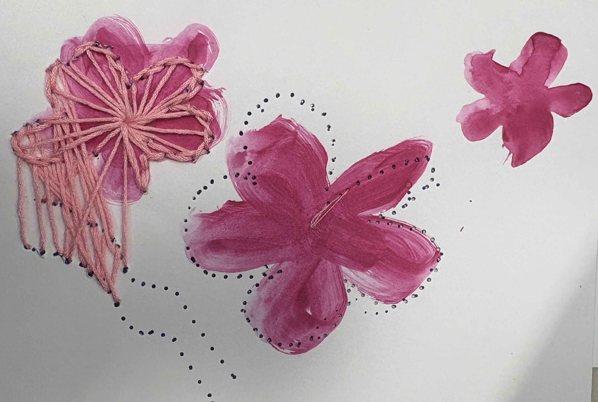
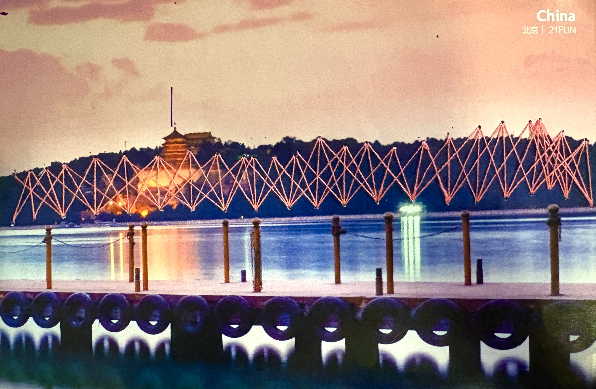
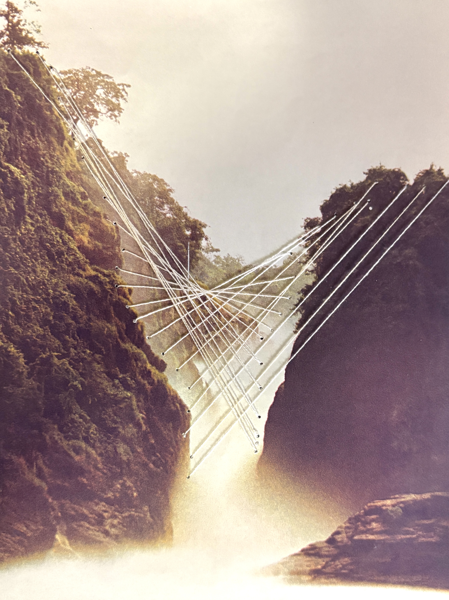
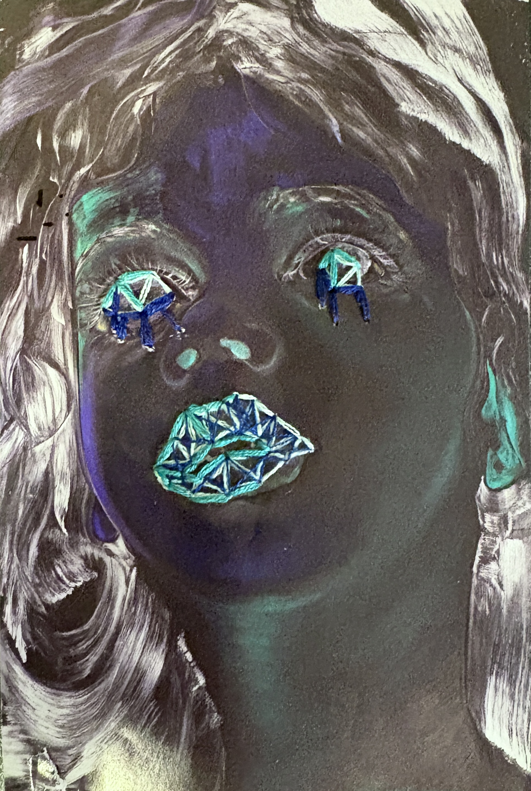
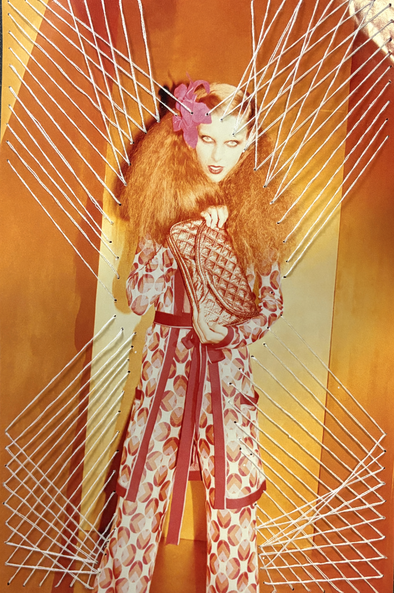
</p>


## Limitation

1. The punched result has a position offset from the path that was originally drawn. We have not figured out the cause yet.

2. We wanted to swap in a stronger servo to lift the punch we designed. Due to time constraints we did not replace it, so for the final presentation we used the pen to demo the punch lines instead of doing the actual punching.

3. The punch intervals are not always equal. The path length generator spaces the punches by the recorded path length, so when the hand hesitates or wavers during recording, the extra length throws off the spacing.


## Reflection

This project made us think harder about what an effective interface for an artist actually is, where it should aim, and what we should be willing to compromise on.

We set out to remove the tedious labor, the punching, and keep the creative labor, designing and threading, with the person. The final artifacts basically matched what we expected to produce.

But the result exposed a tension we did not plan for. In trying to automate the punching, the system either fails to faithfully reproduce what the person drew, and the position offset is one symptom of that, or it adds setup and calibration steps that make a simple hand process more complicated than it was before. Punching paper by hand is not actually that tedious. So the machine has to justify itself on something other than saving effort.

That reframes the question for us. The value of a tool like this is probably not in removing labor, but in enabling something the hand cannot easily do. Precise repetition, consistent spacing, scaling a traced path up or down, or patterns that would be slow to lay out by eye. If we keep working on this, that is what the next version should target, while leaving the hand process where the hand is already good enough.

