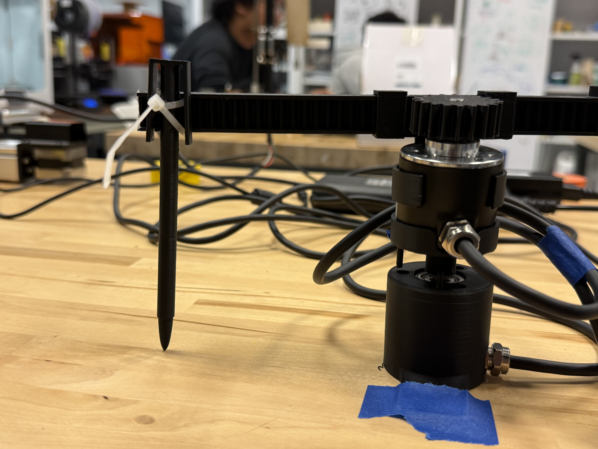
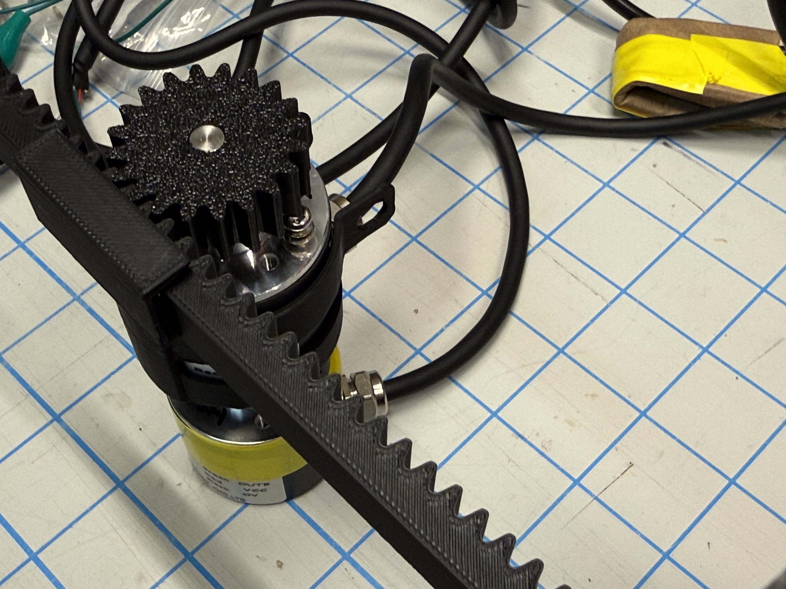
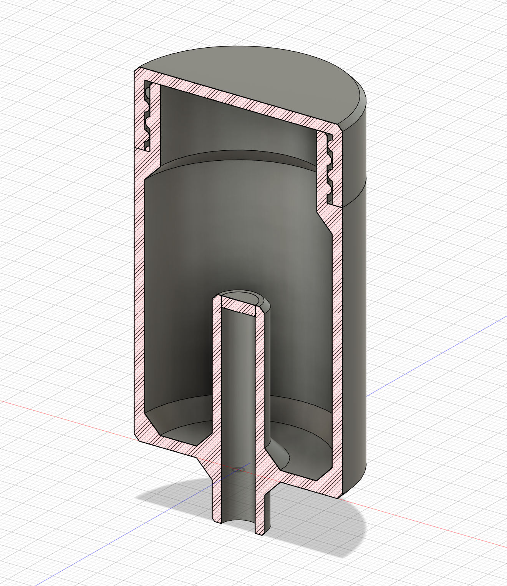
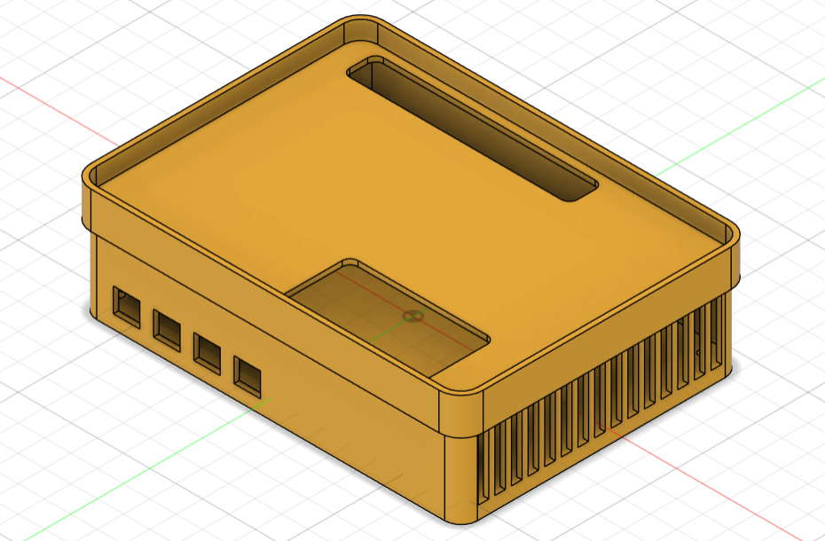
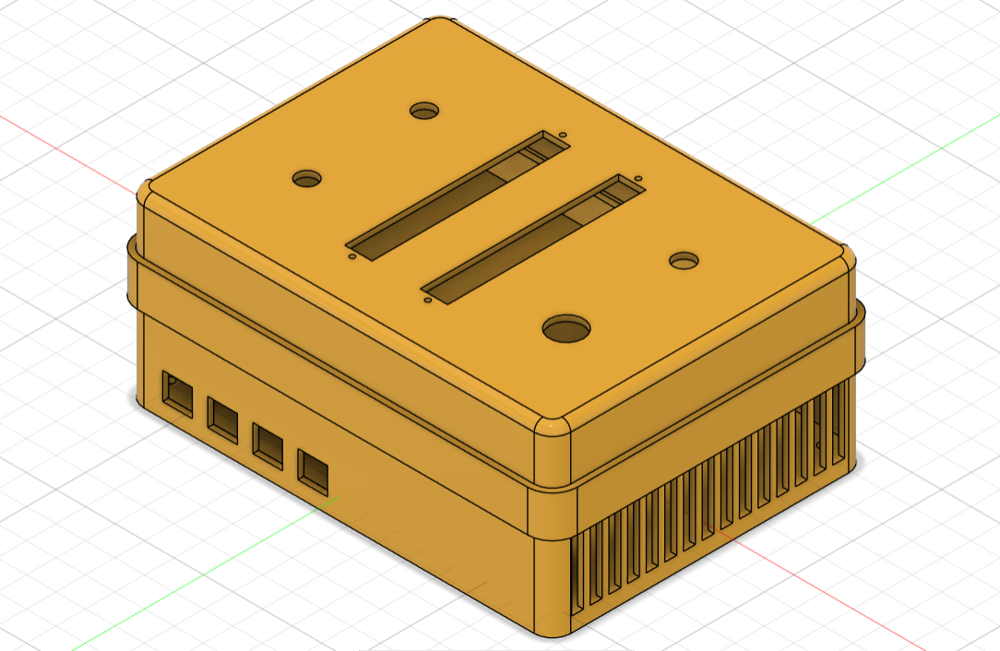

Mid-point

# Peer Review

Time: Monday, 25 May, 3:00 pm - 4:00 pm

- Team Pancho introduced their current progress, presented their prototype, and walked through their stepdance code. Their current difficulties include:
    - The extruder is mounted too high to be properly secured to the main frame
    - It is difficult to visualize the algorithm output before the mechanical structure is fully realized
- They also reflected on their assembly process, highlighting the importance of following the correct assembly order and leaving sufficient clearance for screwdrivers.

- Team Cook offered suggestions to address these challenges. For example, adding a connecting structure between the extruder and the main frame to improve stability, and using an AxiDraw plotter for rapid pattern and movement testing.

- Team Cook shared their current progress, focusing primarily on record-and-playback movement on the AxiDraw via the pantograph interface. They mentioned one current difficulty: the playback trace doesn't exactly replicate the recorded input. They also explained their rationale for choosing the polar pantograph over the five-bar alternative. In response, Team Pancho tried out the pantograph-to-AxiDraw system and suggested improving the stability of the pantograph's pen, making it more responsive (e.g., the mapping issues that show up when drawing a circle), and possibly adding a digital interface to make the control parameters more direct.

# Progress

## Pantograph

We started by testing the five-bar pantograph to see if it could map to the AxiDraw movement, but due to difficulty calibrating the mapping, we designed our own pantograph using two encoders vertically stacked together: the bottom encoder provides angle input, and the top encoder provides radius input through a rack-and-pinion mechanism. The polar coordinates input was transferred to Cartesian coordinates in the code. We made the CAD for both encoders’ housings and the pinion-rack mechanism in SolidWorks. After the first version, we improved the linear rail for the rack, as well as added endstops for the pantograph’s homing position.

<p align = "left">


</p>

Here is a video of their synchronized movement:

<iframe width="560" height="315" src="https://www.youtube.com/embed/boFGgTDFiis" frameborder="0" allowfullscreen></iframe>

#Coding

We referenced the recording and playback example in the library to first record the path of the pantograph and play it back on the AxiDraw. Pressing the record button starts Stepdance recording the pantograph's path while the AxiDraw is disabled; pressing the same button again stops the recording. Pressing the other button triggers playback, and the AxiDraw redraws the recorded path. We also added a slider to adjust the overall mapping scale.

To let the AxiDraw punch at regular intervals along the path, we referenced the 2D path length generator to track the cumulative path length during playback. We then added an interval setting that triggers a punch action on the Z axis each time the accumulated length crosses the next interval. Another analog input was added so the user can adjust the interval in advance.

```cpp
#define module_driver  // tells compiler we're using the Stepdance Driver Module PCB

#include "stepdance.hpp"  // Import the stepdance library

OutputPort output_a;  // Axidraw left motor
OutputPort output_b;  // Axidraw right motor
OutputPort output_c;  // Z axis, a servo driver for the AxiDraw

Channel channel_a;  //AxiDraw "A" axis --> left motor motion
Channel channel_b;  // AxiDraw "B" axis --> right motor motion
Channel channel_z;  // AxiDraw "Z" axis --> pen up/down

KinematicsCoreXY axidraw_kinematics;
KinematicsPolarToCartesian polar_kinematics;

Encoder encoder_radius;  //top
Encoder encoder_theta;   //bottom

Button record_button;
Button play_button;

AnalogInput slider_scaling;
ScalingFilter2D scaling_filter;

AnalogInput analog_punch_interval;
ControlParameter punch_interval;   
float64_t next_punch_at = 0;
bool punch_armed = false;

PositionGenerator position_gen;

FourTrackRecorder recorder;
FourTrackPlayer player;

TimeBasedInterpolator time_based_interpolator;

PathLengthGenerator2D path_length_gen;
float64_t path_length_at_start = 0;


void setup() {
  Serial.begin(115200);

//--basic configurations--
//two encoders directly on the module driver
  output_a.begin(OUTPUT_A);  // "OUTPUT_A" specifies the physical port on the PCB for the output.
  output_b.begin(OUTPUT_B);
  output_c.begin(OUTPUT_C);

  enable_drivers();

  channel_a.begin(&output_a, SIGNAL_E);  // Connects the channel to the "E" signal on "output_a".
  channel_a.set_ratio(25.4, 2032);       // Sets the input/output transmission ratio for the channel.
  channel_a.enable_filtering();
  channel_a.invert_output();             // CALL THIS TO INVERT THE MOTOR DIRECTION IF NEEDED

  channel_b.begin(&output_b, SIGNAL_E);
  channel_b.set_ratio(25.4, 2032);
  channel_b.enable_filtering();
  channel_b.invert_output();

  channel_z.begin(&output_c, SIGNAL_E);  //servo motor, so we use a long pulse width
  channel_z.set_ratio(1, 50);            //straight step pass-thru.

  encoder_theta.begin(ENCODER_1);  // BOTTOM ENCODER
  encoder_theta.set_ratio(TWO_PI, 2400); //mind the ratio
  encoder_theta.output.map(&polar_kinematics.input_angle);
  encoder_theta.invert();

  encoder_radius.begin(ENCODER_2);  // TOP ENCODER
  encoder_radius.set_ratio(24, 2400); //mind the ratio
  encoder_radius.output.map(&polar_kinematics.input_radius);
  encoder_radius.invert();

  // polar_kinematics.output_x.map(&axidraw_kinematics.input_x);
  // polar_kinematics.output_y.map(&axidraw_kinematics.input_y);
  // polar → scaling_filter → axidraw
  polar_kinematics.output_x.map(&scaling_filter.input_1);
  polar_kinematics.output_y.map(&scaling_filter.input_2);
  polar_kinematics.begin();
  
  scaling_filter.begin();
  scaling_filter.output_1.map(&axidraw_kinematics.input_x);
  scaling_filter.output_2.map(&axidraw_kinematics.input_y);

  slider_scaling.set_floor(5.0);     // min_scaling = 5.0
  slider_scaling.set_ceiling(30.0);   // max_scaling = 30.0
  slider_scaling.map(&scaling_filter.ratio);
  slider_scaling.begin(IO_A2);
  
  analog_punch_interval.set_floor(2.0);      // min_interval = 2.0mm
  analog_punch_interval.set_ceiling(50.0);   // max_interval = 50.0mm
  analog_punch_interval.map(&punch_interval);
  analog_punch_interval.begin(IO_A3);

  time_based_interpolator.begin();
  time_based_interpolator.output_z.map(&channel_z.input_target_position);

  axidraw_kinematics.output_a.map(&channel_a.input_target_position);
  axidraw_kinematics.output_b.map(&channel_b.input_target_position);
  axidraw_kinematics.begin();

  path_length_gen.input_1.map(&axidraw_kinematics.input_x);
  path_length_gen.input_2.map(&axidraw_kinematics.input_y);
  path_length_gen.set_ratio(1.0);  // output.distance = 1.0 * input.distance mm
  path_length_gen.begin();
// 
  record_button.begin(IO_D1, INPUT_PULLDOWN);
  record_button.set_mode(BUTTON_MODE_TOGGLE);
  record_button.set_callback_on_press(&start_recording);
  record_button.set_callback_on_release(&stop_recording);

  play_button.begin(IO_D2, INPUT_PULLDOWN);
  play_button.set_mode(BUTTON_MODE_STANDARD);
  play_button.set_callback_on_press(&playback_control);

  recorder.input_1.map(&encoder_theta.output);
  recorder.input_2.map(&encoder_radius.output);
  recorder.begin();

  player.output_1.map(&polar_kinematics.input_angle);
  player.output_2.map(&polar_kinematics.input_radius);
  player.begin();

  dance_start();

  Serial.println("=== SETUP DONE ===");
}

LoopDelay overhead_delay;

void loop() {
  overhead_delay.periodic_call(&report_overhead, 500);
  
  // check if it is the punch position
  if (punch_armed) {
    float64_t current_path_length = path_length_gen.output.read_absolute() - path_length_at_start;
    if (current_path_length >= next_punch_at) {
      player.pause();
      punch_action();
      delay (1000);
      player.resume();
      next_punch_at += punch_interval;   //set the next punch hole
    }
  }
  
  dance_loop(); 
}

void start_recording(){
  disable_drivers();
  path_length_at_start = path_length_gen.output.read_absolute();
  
  recorder.start("my_recording");
  Serial.print("STARTED RECORDING | scaling = ");
  Serial.print(slider_scaling.read(), 3);
  Serial.print(" | punch every ");
  Serial.print(punch_interval, 1);
  Serial.println(" mm");
}

void stop_recording(){
  recorder.stop();
  enable_drivers();
  
  float64_t total_length = path_length_gen.output.read_absolute() - path_length_at_start;
  Serial.print("STOPPED RECORDING | total path length = ");
  Serial.print(total_length, 3);
  Serial.println(" mm");
}

void playback_control(){
  if(player.playback_active){
    stop_playback();
  }else{
    start_playback();
  }
}
 
void start_playback(){
  path_length_at_start = path_length_gen.output.read_absolute();
  punch_armed = true;
  next_punch_at = punch_interval;
  
  player.start("my_recording");
  Serial.print("STARTED PLAYING | punch every ");
  Serial.print(punch_interval, 1);
  Serial.println(" mm");
  
  int duration_s = player.max_num_playback_samples / (CORE_FRAME_FREQ_HZ);
  Serial.print("DURATION: ");
  Serial.print(static_cast<int>(duration_s / 60));
  Serial.print("m:");
  Serial.print(duration_s % 60);
  Serial.println("s");
}
 
void stop_playback(){
  player.stop();
  punch_armed = false;
}

void punch_action(){
  time_based_interpolator.add_timed_move(ABSOLUTE, 0.5, 0, 0, -4, 0, 0, 0);
  time_based_interpolator.add_timed_move(ABSOLUTE, 0.5, 0, 0, 4, 0, 0, 0);
  
  Serial.print("PUNCH at ");
  Serial.print(next_punch_at, 2);
  Serial.println(" mm");
}

void report_overhead(){
  
  if(recorder.recorder_active){
    int duration_s = recorder.current_sample_index / (CORE_FRAME_FREQ_HZ);
    float64_t current_path_length = path_length_gen.output.read_absolute() - path_length_at_start;
    
    Serial.print("REC ");
    Serial.print(static_cast<int>(duration_s / 60));
    Serial.print("m:");
    Serial.print(duration_s % 60);
    Serial.print("s | path length = ");
    Serial.print(current_path_length, 3);
    Serial.println(" mm");
  }
  if(player.playback_active){
    int duration_s = player.current_sample_index / (CORE_FRAME_FREQ_HZ);
    Serial.print("PLAY ");
    Serial.print(static_cast<int>(duration_s / 60));
    Serial.print("m:");
    Serial.print(duration_s % 60);
    Serial.println("s");
  }
}
```

Here is a demonstration video:

<iframe width="560" height="315" src="https://www.youtube.com/embed/X0m5Kvh0e3M" frameborder="0" allowfullscreen></iframe>

## Punch

We CAD-modeled a weight that sits on top of the paper embroidery needle. The lid twists open so the user can place coins or other objects inside to increase the weight as needed.




## Enclosure

We designed a case in CAD that houses both the Stepdance board and the interface:

<p align = "left">


</p>


# Next Steps

1. Mapping: the playback trace doesn't exactly match the recorded input. We're still working on it.

2. There was noise in the AxiDraw's X/Y movements. We added a filter to the channels, which partly solved the problem. We'll try the new encoders next to see if the issue is coming from them. 

3. Punch: So far we've been testing with pens, but the servo may not be strong enough to drive an actual punch. We still need to test this. If it can't, we'll need to swap in a stronger external servo for the Z axis.

4. Integrating with the patterns and interactions we developed in Project-1.

5. Testing the punch with real patterns/photos and embroidery with thread. Hopefully we can put together a short animation of the pattern changing.
