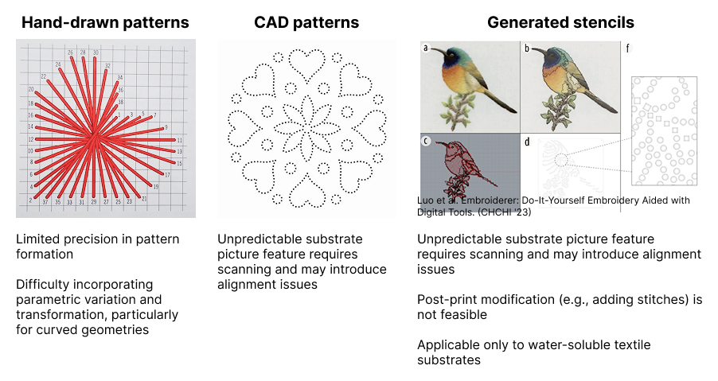
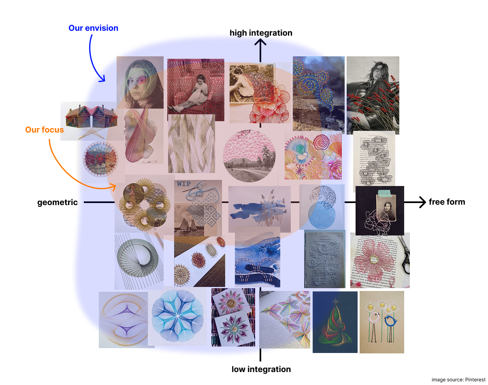
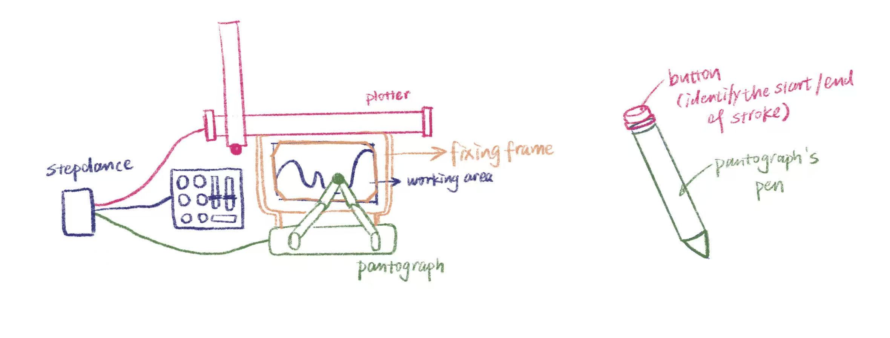
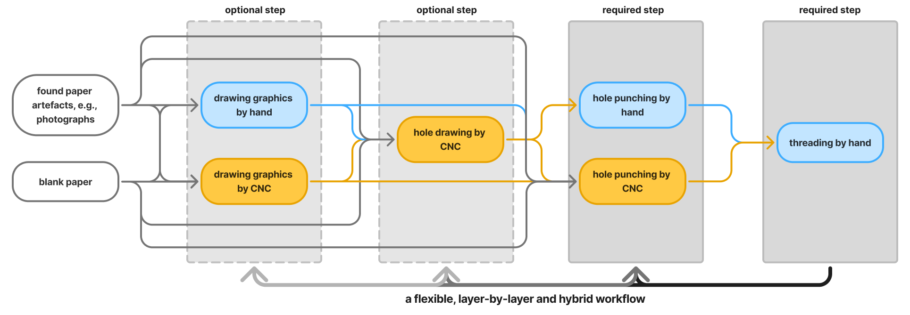
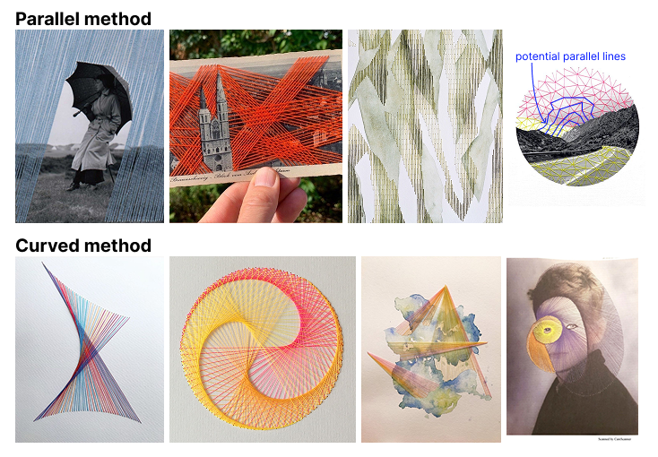

# Final Project - Proposal
## 1. Creative Domain & Justification
**Paper embroidery** is a hybrid craft in which practitioners design a pattern, poke holes into paper along the pattern, and stitch through the holes by hand. The stitches typically follow a simple, repeated rule, gradually forming visually compelling patterns with a computational aesthetic. Beyond traditional geometric motifs (e.g., mandala patterns), the stitches can integrate well with the underlying paper context, such as painting, printing, photos, or collage, expanding its potential in scenario-based narratives and artistic expressions.

Existing approaches to fabricating embroidery artifacts include manually marking dots on grid paper and designing patterns in CAD software (Figure 1). However, these methods either lack precision or make it difficult to incorporate parametric variations and transformations. In context-rich applications (e.g., photo or painted substrates), CAD-based approaches struggle to accommodate unpredictable surface features, or often leading to alignment issues. In human-computer interaction, prior work has explored 3D printing parametrically generated embroidery stencils, but they can only be used on fabric and unable to modify the stitches once applied.

*Figure 1. Existing approaches to fabricating embroidery artifacts.*

Moreover, translating desired patterns into hole maps requires drafting expertise that many practitioners lack, limiting them to simple geometric patterns or pre-defined templates. In our previous interviews with two practitioners, one participant, Kate (pseudonym), noted that designing mandala patterns and placing punching holes in Adobe Illustrator can take an entire day of iterative adjustments to achieve symmetry, even with prior experience.

Featuring **precise hole placement** and **image-to-hole translation**, our tool aims to serve paper embroidery artists who want to expand their work in a **procedural, live, and context-integrated** way. We also envision this tool to support drawing artists, handmade book, card makers, and hobbyists who want to bring the fiber texture of embroidery into their flat work. In Figure 2, we map existing paper embroidery artifacts onto a four-dimensional space. Our approach primarily supports the upper-left region (abstract, highly context-integrated work), while also accommodating low-context applications and more free-form stitching. We hope to extend the visual vocabulary people can participate in, opening it to **photographic images**, **pattern exploration**, and [**experimental animation**](https://www.youtube.com/watch?v=1SXZJs26UKY).

*Figure 2. Mapping of existing paper embroidery artifacts onto a four-dimensional design space.*

## 2. Potential Area of Technical Development: C. Developing a high-resolution custom interface
### Why developing an interface
The hard part of paper embroidery is the creative translation from a visual idea to a stitchable hole map that works alongside painted or printed elements. For our users and artifacts, the interface is the bottleneck. We argue this for three reasons:

1) Our interviews suggest that practitioners view threading as an iterative process involving trial and error, which they consider a key part of creative expression. Rather than automating stitching, we preserve the handcrafted nature of the practice and the flexibility of mixing media, focusing instead on supporting the hole-planning process. From a technical perspective, this problem is largely solved: plotters and 3D printers already offer sub-millimeter precision, and adding a Z-axis poking mechanism is well established in prior work.

2) The most important part in paper embroidery is **hole map planning**: which regions become stitches, how dense the holes should be, how layers stack, and how the painted and stitched parts relate. These are creative decisions that need iteration and live feedback, which a good interface supports and a black-box pipeline does not.

3) The features that define our project (layer-by-layer execution, transformation sequences, paint-stitch coordination) all live in software. Even with custom hardware, these features would still need an interface. By choosing C, we use an existing plotter with manually-swapped tool heads for pen, needle, and brush, and put our effort where it most shapes the tool's character.

### System Overview
As shown in Figure 3, our interface consists of three components: a pantograph that allows the machine to “read” user-defined drawing or hole-punching paths, and a control station with buttons and sliders for generating geometric patterns and adjusting hole-map parameters. An additional button allows users to send the pantograph path directly to the plotter for execution. The plotter and pantograph will share the same working area for the user to directly trace strokes on paper artefacts.

*Figure 3. The three components of our interface: a pantograph, a control station, and a plotter.*

The system supports two output modes: drawing tools and a hole puncher. The drawing module extends the paper into a paintable canvas while also enabling the creation of hole maps.

Our workflow supports a flexible, layered, and hybrid process (Figure 4), allowing users to work fully by hand, use the machine solely for hole-map planning, or delegate the entire process to achieve fully geometric and parametric results.

*Figure 4. Overview of our flexible, layered, and hybrid workflow.*

## 3. Software Requirements
For geometric path generating, we plan to adopt the algorithm in project 1. Our main effort will be applied to translating customized strokes to hole execution.

The user can trace strokes through a pantograph, selecting which areas they want to embroider. The pantograph’s pen will be modified with a simple button to determine the start and end of a stroke. Before each trace, the user chooses a **poking method** (Figure 5) that determines how the traced stroke will be converted into holes:

- **Parallel method**: the traced stroke defines two boundary lines, and the system fills the space between them with parallel lines. Holes are placed along each parallel line. Users control line count and spacing. (can be merged with the curve method)
- **Curve method**: holes follow the stroke at a uniform user-controlled spacing. Also supports closed shapes (e.g. circles) and single dots. When the hole count is set to two, users can form straight lines.
- **Anchor method**: only the endpoints and the corners of the stroke receive holes.

Curve and Parallel methods support an optional **graduated-spacing modifier**, which allows the user to control the rate at which hole spacing increases or decreases along the stroke.

*Figure 5. Embroidery results produced by our poking brush using parallel and curved methods.*

The poking brush is the user's main expressive control. The same traced line can become a band of parallel lines, a continuous outline, stitches radiating between corner points, or a gradient effect after embroidery. The user's role shifts from drafting hole maps to interpreting their own drawing through different visual logics.
Before sending it to the machine, the user can adjust the hole count or hole spacing for each stroke. Strokes can also be batched or have simple variations (position translation, scale, rotation) if preferred, and can be executed more than once.

<!-- A simple live preview during tracing shows roughly where holes would fall, but the real feedback comes from the holes themselves. The painted background remains visible throughout, so users can see how the stitched layer relates to what the machine drew. Hand stitching follows once the user is satisfied. -->

## 4. Required Components (Envisioned)
- A plotter or 3D printer (that we can modify for better Z-axis movement)

- Two manually-swapped tool heads:
    - A drawing brush for painting backgrounds
    - A poking needle head

- A pantograph for capturing user strokes

- A flat work surface with paper clamps or registration pins

- A backing layer (e.g. cork or foam) underneath the paper to receive the needle

- A StepDance board

- Servo motors for the poking action (perhaps)

- Thick papers

- Ink or paint compatible with the brush head

- Sliders and buttons

## 5. Questions & Challenges
1) **Should we provide a digital live preview of hole positions before poking?**
<!-- If yes, how it stays in sync with what the machine will actually do(Pantograph - P5 - stepdance). If the data flow from pantograph to plotter introduces noticeable lag, the rhythm of the interaction breaks. -->

2) The paper mentions paths can be stored. **What does the stored data actually contain, and how can we access and manipulate it?** We want to use it for hole generation, stroke replay, and applying transformations.

3) **Calibrating the pantograph and the plotter to share a coordinate system.** The user's gesture has to map onto the actual paper position, and any drift will add up across strokes.

4) **Communicating stitch grouping through holes alone.** A sheet of dots does not tell the embroiderer which holes belong to the same parallel line or the same contour. One idea is to use the brush module to draw light guide marks next to the holes, but how much guidance to give without limiting creative freedom is still open.

5) **Preview fidelity across brushes.** Some brushes like curve are easy to preview faithfully. Others like parallel-line are harder, since they need to interpret two strokes as boundaries. We may need a different preview strategy for each brush.

6) **Balance the functionality and simplicity of the interface**

7) **Mechanism with punch needle**
