# Project 1: Interactive Moiré Pattern Plotter

## Concept

We envision an interactive CNC plotter system for creating animated moiré patterns through layered drawing and real-time user control. [Moiré patterns](https://en.wikipedia.org/wiki/Moir%C3%A9_pattern#) arise when similar repetitive patterns overlap and shift relative to one another, producing compelling visual illusions of movement. Building on this principle, our system enables users to design and customize pattern types such as lines, grids, radial, and concentric forms, along with parameters like spacing, density, scaling, and rotation through an intuitive interface, then generates these patterns layer by layer using a plotter.

<p align = "left">


</p>

The patterns will be printed on transparent films on a transparent platform. After the first layer is printed, it can be placed on a movable plate under the platform capable of translation or rotation. As the plotter continues to draw, the relative motion between these layers allows users to directly observe the emergence of animated moiré effects in real time. Additional layers can be added to increase visual complexity.

By integrating live parameter adjustment, physical motion, and diverse drawing media, the system transforms traditionally static geometric patterns into an embodied, real-time generative animation experience.

## Design

We began by defining the machine setup, the pattern types, the drawing media, and the key interaction parameters. We decided to first develop and test each pattern separately before combining them into layered compositions. In early experiments, we found that if two patterns are not similar enough, the moiré effect becomes weak or unclear. Based on this, we limited the range of user input to keep patterns within a controlled variation range.

#### Machine Design:
 

#### Visual Output:
- Grids: lines, waves, dots
- Concentric patterns: circles, squares
- Radial patterns: spiral, radial lines, dots

#### Drawing Media:
- Pen
- Technical pen
- Brush
- Water color pen
- Transparent film papers / tracing paper

#### Interaction Design:
- Select a pattern type
- Adjust the number of lines
- Control wave generation - x,y of the pen: straight or curved lines
- Control wave generation - z of the pen: dots or short lines, stroke thickness
- Adjust movement speed
- Control spacing: absolute spacing, gradual changes (increasing or decreasing spacing over time)

## Implementation


We initially explored spiral patterns using the wave generators. The system operates in polar coordinates, where both the angle and the radius are driven continuously. To control the motion, we use two velocity generators: one for the angle and one for the radius, and map the output through polar-to-Cartesian kinematics to drive the plotter. In this setup, the plotter first produces spiral patterns. By adding z-axis control to lift the pen at intervals and adjusting the relative speeds of the two velocity generators, we were able to segment the spiral and produce paths that visually similar to concentric circles. By further modifying the z movement, the system can also generate discrete concentric curves or even dots. Then we focused on adding more variations to the spiral pattern, for example, adding extra wave generators in the x and y directions to draw wave curves while the spiral movement. By exploring the mapping methods, we found that the spacing between each circle can also be varied using an extra wave generator, which creates a 3D effect visually. 

However, to add these extra three wave generators, we need to control an extra six parameters, which exceeds the available analog ports right now. To solve this challenge, we reflected on the key parameters users need to control in real-time. Rather than changing the wave's shape in detail while drawing, it's more convenient for the users to think about and decide on the wave's "size" (amplitude) and "speed" (frequency). Thus, we implemented two scaling factors controlled by potentiometers that control the x and y waves' frequency and amplitude separately. 

For the final interactions, users can adjust the basic spiral spacing, basic wave amplitude and frequency using serial communication. They can also conveniently control the drawing velocity, wave scale, and z-axis pen movement frequency using potentiometers.

<p align = "left">
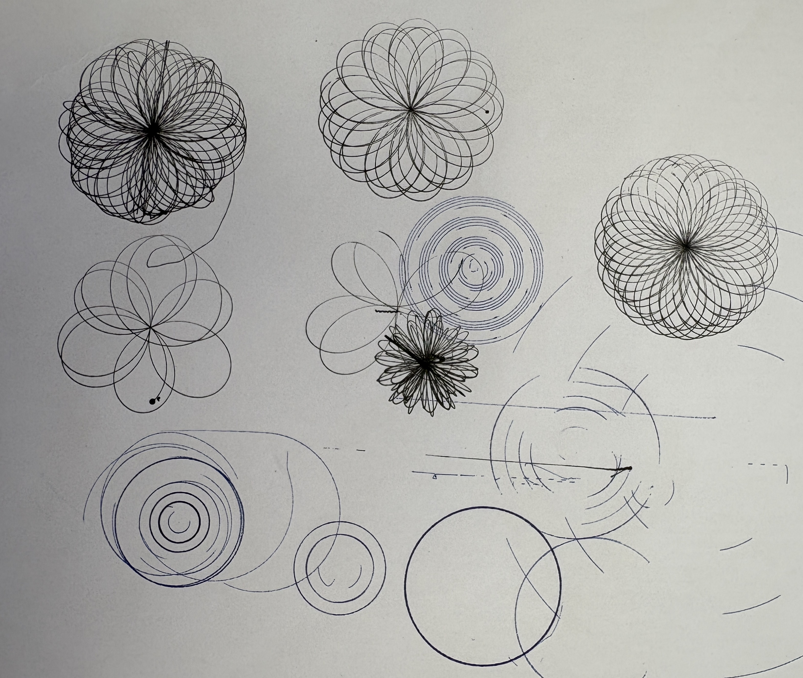
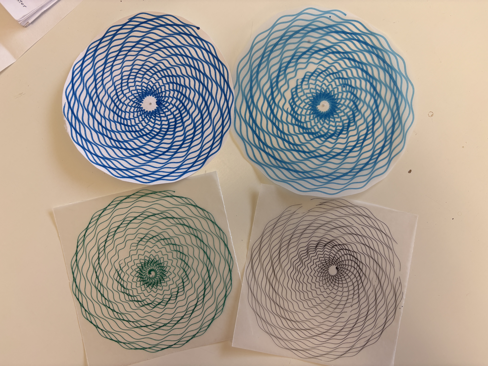
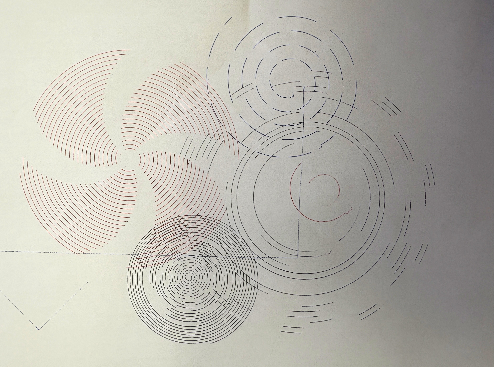
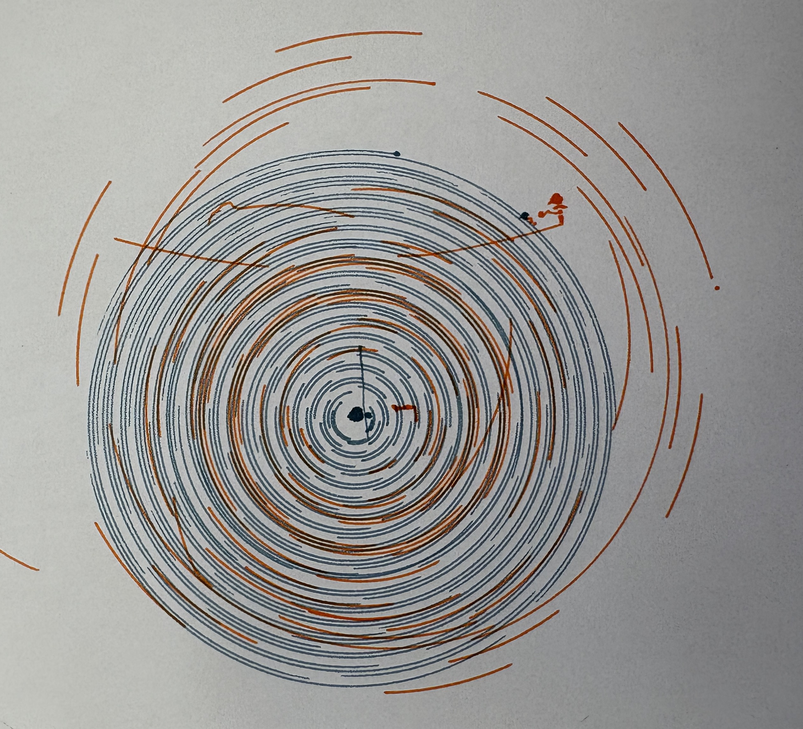
</p>

We then worked on grid patterns. At first, we put a series of position generators into a for loop. However, all the motions were executed at one time, and we can only draw one line at a time by pushing a button. After learning the time-based interpolator (TBI), the implementation became much simpler. We used a for loop to generate evenly spaced lines to form the grid. By using the wave generator, the straight lines can be distorted. With additional z-axis control, the length of each line can vary, creating a lattice-like effect. One limitation we encountered is that in StepDance, the TBI can only support up to 100 motions. We initially let the plotter draw a vertical and horizontal line alternately; however, the plotter stopped before the drawing was completed due to the TBI queue limitations. We solved this by separating the horizontal line and the vertical line drawing into two functions, which can be triggered by pushing and releasing the button alternately. This also allows users to only draw parallel lines, and change spacing and drawing pen when switching drawing directions, forming richer pattern combinations.

For the final interaction, users can set the number of lines (analog_1), basic oscillation frequency & amplitude (serial), drawing area (serial), and velocity (serial) before drawing. During drawing, users can vary the oscillation scaling factor in amplitude and frequency (analog_3, analog_4), and pen up and down movement frequency to achieve varied line length(analog_2). Users can push button_2 to draw vertical lines, and push button_2 again to draw horizontal lines.

<p align = "left">
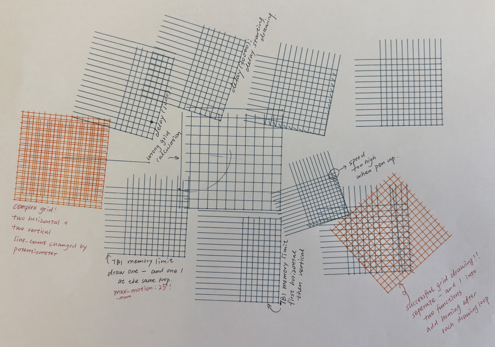
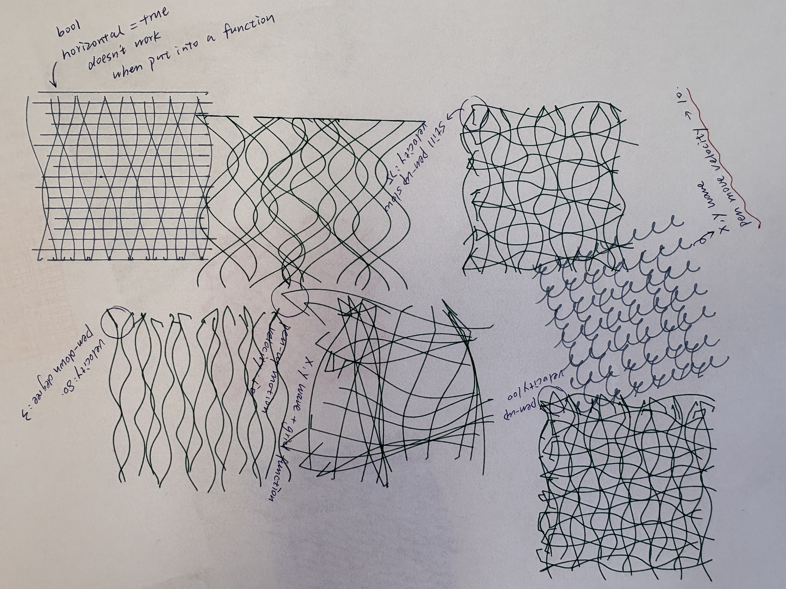
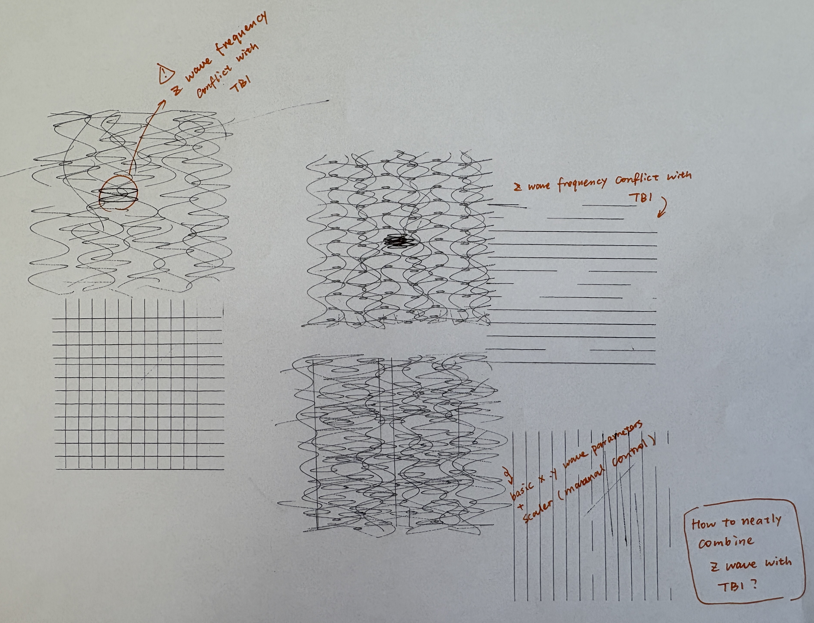
</p>

By defining x and y in the TBI to distribute points evenly around a center, we are able to generate radial lines. After adding the wave generator, we observed that the distortion mainly occurred along one direction, while the other direction appeared compressed, resulting in uneven patterns. To address this, we modified the TBI using a polar-coordinate approach, mapping the TBI and wave generator to radius and angle channels. However, the wave generator under polar coordinates formed severe oscillations when the radius gets bigger, which could be dangerous to users and the machine. Finally, we decided to abandon the wave generator, but added an angle deviation in the TBI motion loop, so that the radial lines can be curved at a certain angle. 

For the final interaction, users can change the number of lines they are going to draw(analog_1), drawing area or line length (analog_4), angle deviation (analog_3), drawing speed(serial), as well as pen up and down movement frequency to achieve varied line length (analog_2).

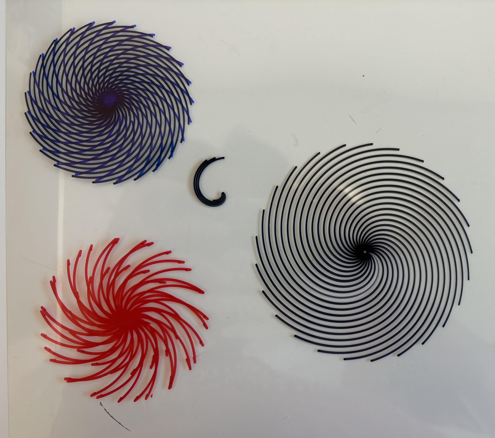

We finally worked on concentric square patterns. Using the TBI, we initially defined square paths and used a for loop to gradually increase the side length, generating multiple layers of squares from the center outward. However, we met the same issue of TBI queuing limitations as the grid patterns, causing very limited squares generated in one cycle, hindering the moire pattern formation. We adopted the method of grid patterns that separates vertical lines and horizontal lines, by adding two flags indicating the alternating sides of the square edges. Finally, we added two x and y generators so that these square edges can also be distorted. 

For the final interaction, users can change the number of lines they are going to draw(analog_1), basic oscillation frequency & amplitude (serial), drawing area (serial), and velocity (serial). During drawing, users can vary the oscillation scaling factor in amplitude and frequency (analog_3, analog_4), and pen up and down movement frequency to achieve varied line length(analog_2).

<p align = "left">
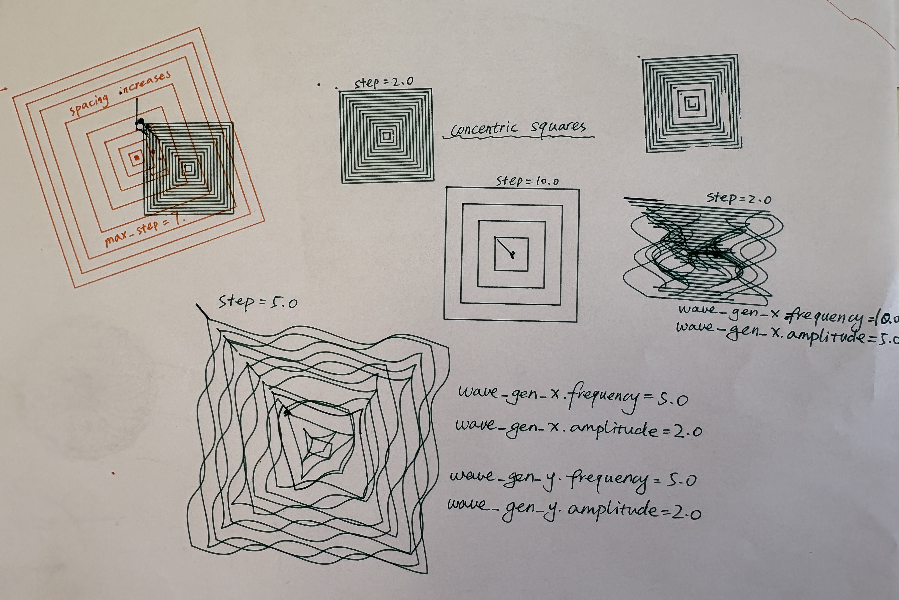
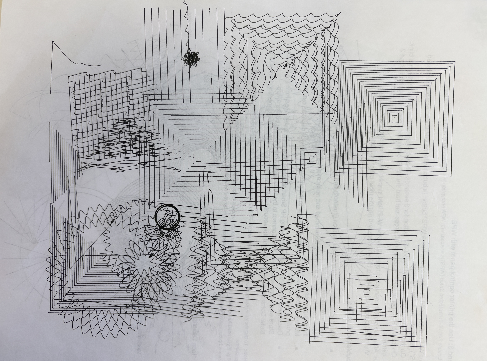
</p>

To combine everything, we organized each pattern into separate functions and used a serial command to toggle between different modes. 

### Hardware Setup

We used two buttons and four potentiometers (two sliders and two knobs) as input controls for adjusting system parameters. One button is used to switch between pattern types, while the other controls the start and stop of the machine.

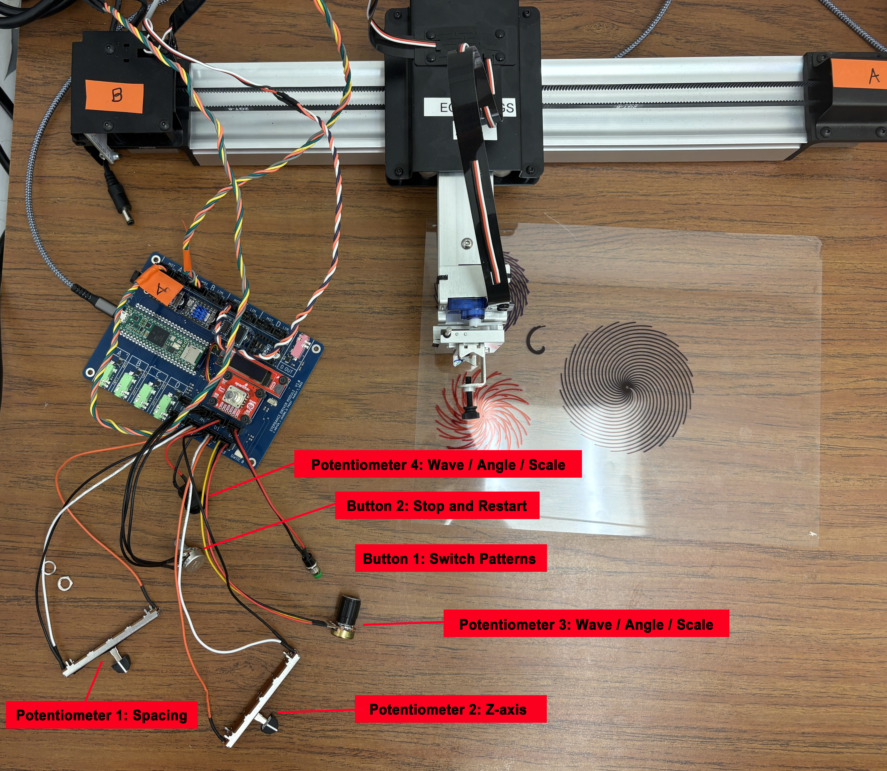

### Code Overview

#### Spiral / Radial Dots / Concentric Circles

```cpp
void draw_circle_setup(){

  position_gen_r.output.map(&polar_kinematics.input_radius);
  position_gen_r.begin();

  //wave radius variation
  wave_gen_r.setNoInput(); 
  wave_gen_r.frequency = 0; //analog_a2
  wave_gen_r.amplitude = 0.6; //analog_a3
  wave_gen_r.begin();

  //ciecle spacing variation - serial command
  wave_gen_s.setNoInput(); 
  wave_gen_s.frequency = 0.1;
  wave_gen_s.amplitude = 0.2;
  wave_gen_s.begin();

  //circle spacing constant
  velocity_gen_r.begin();
  velocity_gen_r.speed_units_per_sec = 0.15; //basic circle spacing - serial command

  //turning speed constant
  velocity_gen_a.begin();
  velocity_gen_a.speed_units_per_sec = 0.8; //basic turning speed - analog_a4

}


void draw_circle_loop(){
  polar_kinematics.enable();

  wave_gen_r.output.map(&polar_kinematics.input_radius);
  wave_gen_s.output.map(&polar_kinematics.input_radius);
  velocity_gen_r.output.map(&polar_kinematics.input_radius);
  velocity_gen_a.output.map(&polar_kinematics.input_angle);

  //z axis pen movement frequency
  analog_a2.set_floor(0.0, 25);
  analog_a2.set_ceiling(10, 1020); 
  analog_a2.map(&wave_gen_z.frequency);

  analog_a1.set_floor(0.0, 25);
  analog_a1.set_ceiling(15.0, 1020); 
  analog_a1.map(&wave_gen_r.frequency);

  analog_a3.set_floor(0.0, 25);
  analog_a3.set_ceiling(15.0, 1020); 
  analog_a3.map(&wave_gen_r.amplitude);

  analog_a4.set_floor(0.0, 25);
  analog_a4.set_ceiling(2.0, 1020); 
  analog_a4.map(&velocity_gen_a.speed_units_per_sec);

}
```

#### Grids

```cpp
void draw_grid_setup(){

  wave_gen_x.setNoInput(); 
  wave_gen_x.frequency = 0.0; 
  wave_gen_x.amplitude = 0.0; 
  wave_gen_x.begin();

  wave_gen_y.setNoInput(); 
  wave_gen_y.frequency = 0.0; 
  wave_gen_y.amplitude = 0.0;
  wave_gen_y.begin();


}


void draw_grid_loop(){
  time_based_interpolator.output_x.map(&axidraw_kinematics.input_x);
  time_based_interpolator.output_y.map(&axidraw_kinematics.input_y);

  wave_gen_x.output.map(&axidraw_kinematics.input_x);
  wave_gen_y.output.map(&axidraw_kinematics.input_y);

  //line_count
  analog_a1.set_floor(4, 25);
  analog_a1.set_ceiling(25, 1020); //memory limit: 25 motion
  
  //z- wave frequency
  analog_a2.set_floor(0.0, 25);
  analog_a2.set_ceiling(10, 1020);
  analog_a2.map(&wave_gen_z.frequency);

  //x y wave scaler amplitude
  analog_a3.set_floor(0, 25);
  analog_a3.set_ceiling(3, 1020);

  //x y wave scaler frequency
  analog_a4.set_floor(0, 25);
  analog_a4.set_ceiling(4, 1020);
  
  line_count = analog_a1.read();
  spacing= drawing_area / line_count;
  line_length = spacing * (line_count - 1);

  xy_wave_scaler_a = analog_a3.read();
  xy_wave_scaler_f = analog_a4.read();

  wave_gen_x.frequency = basic_wave_x_f * xy_wave_scaler_f; 
  wave_gen_x.amplitude = basic_wave_x_a * xy_wave_scaler_a; 
  wave_gen_y.frequency = basic_wave_y_f * xy_wave_scaler_f; 
  wave_gen_y.amplitude = basic_wave_y_a * xy_wave_scaler_a; 

  polar_kinematics.disable();
}
void draw_grid_horizontal() {

  for(int i = 0; i <line_count-1; i++){
  // mode, vel, x, y, z, 0, 0, 0
  // pen up, move to horizontal line starting point
  time_based_interpolator.add_move(GLOBAL, 50.0, -line_length / 2, -i * spacing + line_length / 2, 3, 0, 0, 0); 

  //pen down
  time_based_interpolator.add_move(GLOBAL, 50.0, -line_length / 2, -i * spacing + line_length / 2, -3, 0, 0, 0); 

  //draw a horizontal line
  time_based_interpolator.add_move(GLOBAL, drawing_velocity, line_length / 2, -i * spacing + line_length / 2, -3, 0, 0, 0); 

  //pen up
  time_based_interpolator.add_move(GLOBAL, 50.0, line_length / 2, -i * spacing + line_length / 2, 3, 0, 0, 0); 

  }

  //go to home
  time_based_interpolator.add_move(GLOBAL, 50.0, 0, 0, 0, 0, 0, 0); // go to home after drawing

}

void draw_grid_vertical() {

  for(int i = 0; i <line_count-1; i++){
  // mode, vel, x, y, z, 0, 0, 0
  //pen up, move to the vertical line starting point
  time_based_interpolator.add_move(GLOBAL, 50.0, -i * spacing + line_length / 2, -line_length / 2, 3, 0, 0, 0); 

  //pen down
  time_based_interpolator.add_move(GLOBAL, 50.0, -i * spacing + line_length / 2, -line_length / 2, -3, 0, 0, 0); 

  //draw a vertical line
  time_based_interpolator.add_move(GLOBAL, drawing_velocity, -i * spacing + line_length / 2, line_length / 2, -3, 0, 0, 0); 

  //pen up
  time_based_interpolator.add_move(GLOBAL, 50.0, -i * spacing + line_length / 2, line_length / 2, 3, 0, 0, 0); 

  }

//go to home
  time_based_interpolator.add_move(GLOBAL, 50.0, 0, 0, 0, 0, 0, 0);  //go to home after drawing 

}
```

#### Radial Lines/ Waves

```cpp


void draw_radial() {

  radial_length = drawing_area / 2;

  for (int i = 0; i < radial_lines; i++) {
    //pen up, move to origin
    time_based_interpolator.add_move(GLOBAL, 20, 0, 2 * PI * i / radial_lines, 4, 0, 0, 0);
    //pen down
    time_based_interpolator.add_move(GLOBAL, 50, 0, 2 * PI * i / radial_lines, -4, 0, 0, 0);
    //draw line
    time_based_interpolator.add_move(GLOBAL, drawing_velocity, radial_length, 2 * PI * i / radial_lines + deviation * PI, -4, 0, 0, 0);
    //pen up
    time_based_interpolator.add_move(GLOBAL, 80, radial_length, 2 * PI * i / radial_lines + deviation * PI, 4, 0, 0, 0);
  }

  //go to home
  time_based_interpolator.add_move(GLOBAL, 50.0, 0, 2 * PI, 0, 0, 0, 0); 

}

void draw_radial_loop(){
  time_based_interpolator.output_x.map(&polar_kinematics.input_radius);
  time_based_interpolator.output_y.map(&polar_kinematics.input_angle);

  //line_count
  analog_a1.set_floor(3, 25);
  analog_a1.set_ceiling(25, 1020);
  radial_lines = analog_a1.read();

  //z- wave frequency
  analog_a2.set_floor(0.0, 25);
  analog_a2.set_ceiling(10, 1020);//15
  analog_a2.map(&wave_gen_z.frequency);

  //angle deviation
  analog_a3.set_floor(0, 25);
  analog_a3.set_ceiling(1.5, 1020);
  deviation = analog_a3.read();

  analog_a4.set_floor(10, 25);
  analog_a4.set_ceiling(150, 1020);
  drawing_area = analog_a4.read();
  
}
```

#### Concentric Squares

```cpp
void draw_squares_vertical() {
  
  for (int i = 1; i <= square_count; i++) {
    float half = i * drawing_area / (square_count * 2.0);
    if (flag_v == 0){  
    time_based_interpolator.add_move(GLOBAL, drawing_velocity, +half, +half, 4, 0, 0, 0);
    // pen down draw a line
    time_based_interpolator.add_move(GLOBAL, drawing_velocity, +half, +half, -4, 0, 0, 0);
    time_based_interpolator.add_move(GLOBAL, drawing_velocity, +half, -half, -4, 0, 0, 0);
    //pen up
    time_based_interpolator.add_move(GLOBAL, 80, +half, -half, 4, 0, 0, 0);

    }
    else{
    // pen up, move to the drawing starting point
    time_based_interpolator.add_move(GLOBAL, drawing_velocity, -half, -half, 4, 0, 0, 0);
    // pen down draw a line
    time_based_interpolator.add_move(GLOBAL, drawing_velocity, -half, -half, -4, 0, 0, 0);
    time_based_interpolator.add_move(GLOBAL, drawing_velocity, -half, +half, -4, 0, 0, 0);
    //pen up
    time_based_interpolator.add_move(GLOBAL, 80, -half, +half, 4, 0, 0, 0);
    }
  }

   if(flag_v == 0){
    flag_v = 1;
  }
  else{
    flag_v = 0;
  }

  //go to home
  time_based_interpolator.add_move(GLOBAL, 20.0, 0, 0, 0, 0, 0, 0); 

}

void draw_squares_horizontal() {
  float vel = 20.0;
  
  for (int i = 1; i <= square_count; i++) {
    float half = i * drawing_area / (square_count * 2.0);
    if (flag_h == 0){  

    time_based_interpolator.add_move(GLOBAL, vel, +half, +half, 4, 0, 0, 0);
    // pen down draw a line
    time_based_interpolator.add_move(GLOBAL, vel, +half, +half, -4, 0, 0, 0);
    time_based_interpolator.add_move(GLOBAL, vel, -half, +half, -4, 0, 0, 0);
    //pen up
    time_based_interpolator.add_move(GLOBAL, 80, -half, +half, 4, 0, 0, 0);
    }
    else{
    // pen up, move to the drawing starting point
    time_based_interpolator.add_move(GLOBAL, vel, -half, -half, 4, 0, 0, 0);
    // pen down draw a line
    time_based_interpolator.add_move(GLOBAL, vel, -half, -half, -4, 0, 0, 0);
    time_based_interpolator.add_move(GLOBAL, vel, +half, -half, -4, 0, 0, 0);
    //pen up
    time_based_interpolator.add_move(GLOBAL, 80, +half, -half, 4, 0, 0, 0);
    }
  }

  if(flag_h == 0){
    flag_h = 1;
  }
  else{
    flag_h = 0;
  }
```

## Results

<iframe width="560" height="315"
src="https://www.youtube.com/embed/SYvDYnnxaHw"
frameborder="0"
allowfullscreen>
</iframe>

Transparent platform display - to be continued...

## Reflection

We found working with polar coordinates especially interesting, as controlling angle and radius creates relative motion that feels intuitive yet produces complex and unexpected results. After learning TBI, we also developed a better understanding of how to construct motion sequences and how small adjustments in timing and parameters can lead to noticeable differences in the final output.

Due to system limitations, we had to make several tradeoffs, such as simplifying pattern resolution and constraining parameter ranges to maintain stable results. To continue this project, we would refine the physical interface using 3D printing or laser cutting to create a more playful control device, consider a Raspberry Pi for better integration, and develop a tangible output such as a pull or rotating card so users can take the results with them.
